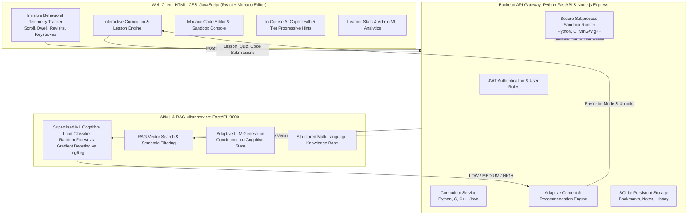

# Cognitive-Load-Aware Adaptive Learning Engine

> **AI/ML + RAG + LLM + Adaptive E-Learning Platform** for Python, C, C++, and Java.

A full-stack adaptive programming education platform featuring a **Supervised Cognitive Load Prediction Engine** that continuously measures learner behavioral telemetry in real-time, predicts cognitive state (**LOW**, **MEDIUM**, **HIGH**), and automatically adapts lesson pacing, explanation depth, quiz difficulty, and coding challenge recommendations.

---

## 🌐 Live GitHub Pages Deployment (Fixing README Output)

If your GitHub Pages is currently showing this `README.md` file instead of the interactive application, follow these simple 30-second steps to point GitHub Pages to the built web app:

1. In your GitHub repository, click on **Settings** (top right navigation).
2. In the left sidebar, select **Pages** (under the "Code and automation" section).
3. Under **Build and deployment**:
   - **Source**: Select `Deploy from a branch`
   - **Branch**: Select `main`
   - **Folder**: Select `/docs` *(Important: select `/docs`, not `/(root)`)*
   - Click **Save**.
4. Wait 30 seconds for GitHub to publish.
5. Your live interactive website will now be accessible at:
   `https://<your-username>.github.io/cognitive/`

---

## 🌟 Key Architecture & Features



---

## 💻 Tech Stack & Codebase Structure

- **Web Frontend**: Built and exported to pure **HTML5, CSS3, and JavaScript** in the `/docs` directory for native GitHub Pages deployment without any server prerequisite. Powered by React, Tailwind, and Monaco Editor.
- **Backend Options**:
  - **Native Python Backend**: Built with **FastAPI** in `python_backend/` utilizing SQLite, subprocess sandboxing, and direct ML/RAG integration.
  - **Node.js Gateway**: Built with **Express & TypeScript** in `server/`.
- **Machine Learning & RAG**:
  - **Supervised ML Models**: Random Forest (Champion, F1: 1.0), Gradient Boosting, Decision Tree, Logistic Regression in `ml_service/app/ml/`.
  - **RAG & Knowledge Retrieval**: Semantic vector search across multi-language knowledge bases in `ml_service/app/rag/`.

---

## 🚀 Quick Start Guide

### Option 1: Zero-Command One-Click Launcher
Starts the Python ML Engine, Backend Gateway, and Vite Client with a single command:
```bash
npm start
# or double click start.bat on Windows
```

### Option 2: Native Python Backend
To run the entire backend exclusively in Python:
```bash
# 1. Install dependencies
pip install -r ml_service/requirements.txt
pip install fastapi uvicorn pydantic

# 2. Start the Python Backend (Port 5000)
python python_backend/run.py
# or: npm run dev:py-backend

# 3. Start the Web Client (Port 3000)
npm run dev:client
```

### Option 3: Building Static HTML/CSS/JS for GitHub Pages
```bash
# Compiles the web application into /docs (HTML, CSS, JS) with relative paths and .nojekyll
npm run build:docs
```

---

## 🧪 Verification & Automated Testing

Run the full end-to-end integration test suite across all 18 curriculum, diagnostic, telemetry, ML prediction, bookmarks, notes, and learning history components:
```bash
python scripts/verify_platform.py
```
Expected result:
```text
==================================================================
🎉 ALL E2E PLATFORM INTEGRATION CHECKS (SECTIONS 108-118) PASSED 100%!
==================================================================
```
