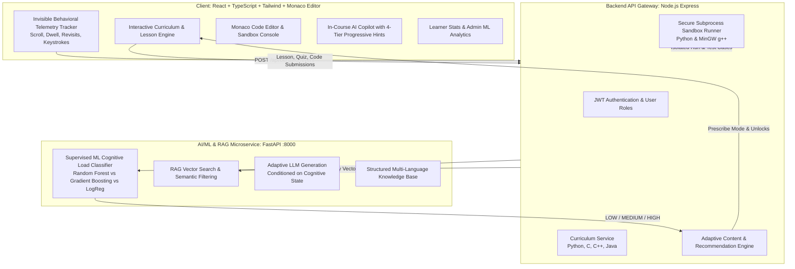

# Cognitive-Load-Aware Adaptive Learning Engine

> **AI/ML + RAG + LLM + Adaptive E-Learning Platform** for Python, C, C++, and Java.

A full-stack adaptive programming education platform featuring a **Supervised Cognitive Load Prediction Engine** that continuously measures learner behavioral telemetry in real-time, predicts cognitive state (**LOW**, **MEDIUM**, **HIGH**), and automatically adapts lesson pacing, explanation depth, quiz difficulty, and coding challenge recommendations.

---

## 🌟 Key Architecture & Features



### 1. Real-Time Cognitive Load Engine
- **Telemetry Signals**:
  - `scroll_time`: Duration actively scrolling/inspecting concepts.
  - `topic_time`: Total dwell time on topic.
  - `page_revisit_count`: Returning to previous concepts indicating hesitation.
  - `mcq_time` & `mcq_accuracy`: Speed and correctness on knowledge checks.
  - `coding_time`, `coding_attempts`, `coding_error_count`: Compilation and runtime friction.
  - `hint_count` & `explanation_request_count`: Frequency of seeking automated assistance.
  - `unusual_completion_signal`: Detects anomalies (e.g. 10-minute challenge solved in 8 seconds with 0 keystrokes) for non-punitive review.
- **Supervised ML Models Compared**:
  - Logistic Regression
  - Decision Tree
  - Random Forest (Champion)
  - Gradient Boosting
  - Evaluated on Accuracy, Precision, Recall, Macro F1, 5-Fold Cross-Validation, and Confusion Matrix.

### 2. Adaptive Learning Loop & Content Modes
- **LOW Cognitive Load**:
  - Learner is confident and fluid.
  - Action: Accelerates progression, provides concise fast-track summaries, advanced optimization tips, and harder coding challenges.
- **MEDIUM Cognitive Load**:
  - Balanced engagement.
  - Action: Standard depth, guided examples, steady progression, progressive hints.
- **HIGH Cognitive Load**:
  - Learner is encountering friction.
  - Action: Automatically switches to **Simplified Mode** with real-world analogies, step-by-step micro-concepts, beginner examples, common pitfalls highlight, and prerequisite topic recommendations.

### 3. RAG Knowledge Pipeline & Progressive 4-Tier Hints
- Vector retrieval indexed over modular knowledge bases for Python, C, C++, and Java.
- Filtered retrieval by `language`, `topic`, and `cognitive_load`.
- **4-Tier Progressive Hints** (Anti-Spoiling):
  1. *Tier 1*: Conceptual Clue.
  2. *Tier 2*: Algorithmic Strategy.
  3. *Tier 3*: Pseudocode Blueprint.
  4. *Tier 4*: Code Skeleton with fill-in-the-blank placeholders (never dumps complete solutions directly).

### 4. Safe Code Execution Sandbox
- Isolated subprocess runner with strict 5000ms timeout enforcement.
- Native Python execution via `python -c` in isolated temporary scratch directories.
- C and C++ compilation and execution via MinGW `g++.exe` with stdin piping.
- Automated validation against visible and hidden test cases.

---

## 🚀 Quick Start Guide (Zero-Command Automation)

### ⭐ One-Click Automatic Launch (Recommended)
You do not need to run manual commands. Everything starts and opens automatically!

1. **Windows**: Simply double-click **`start.bat`** in the project folder.
2. **Cross-Platform**: Run `npm start` (or `node launcher.js`).

**What happens automatically:**
- Spawns the **Python ML/RAG Microservice** on port `8000`.
- Spawns the **Node.js Express Backend** on port `5000`.
- Spawns the **Vite React Client** on port `3000`.
- **Automatically opens your default web browser** to `http://localhost:3000`!
- **To stop everything**: Double-click **`stop.bat`** or press `Ctrl+C` in the launcher window.

### 🌐 Zero-Command In-Browser Control Center
Once in the browser, all platform operations can be triggered with one click without touching the terminal:
- **Retrain Machine Learning Model**: In *Admin Analytics*, click **"Retrain ML Model"** to regenerate datasets, retrain Random Forest / Gradient Boosting, and update model weights in real-time.
- **Reindex RAG Knowledge Base**: Click **"Re-index Knowledge Base"** to re-embed topics across Python, C, C++, and Java.
- **Run Live System Diagnostics**: Click **"Run Full System Diagnostics"** to run a comprehensive 8-stage automated audit across ML, RAG, Code Sandboxes, and Database with live log output in an in-browser console!
- **Execute Code**: In *Coding Studio*, code is compiled and executed in real-time with sandboxed test case grading.

---

### Manual Launch (Alternative)
If you prefer running services individually:

#### 1. Launch Python ML & RAG Microservice
```bash
python -m uvicorn ml_service.app.main:app --host 127.0.0.1 --port 8000
```
*ML service runs at `http://127.0.0.1:8000` with Swagger docs at `http://127.0.0.1:8000/docs`.*

#### 2. Launch Backend API Gateway
```bash
cd server
npm run dev
```
*Backend API runs at `http://localhost:5000/api`.*

#### 3. Launch Frontend React Application
```bash
cd client
npm run dev
```
*Open `http://localhost:3000` in your browser.*

---

## 📡 API Reference

### Telemetry Ingestion (Section 23)
- `POST /api/behavior/event`
```json
{
  "topic_id": "top-py-loops",
  "event_type": "SCROLL",
  "duration": 25,
  "metadata": { "scroll_depth": 0.8 }
}
```

### ML Cognitive Load Prediction (Section 24)
- `POST /api/ml/predict-cognitive-load`
```json
{
  "scroll_time": 180,
  "topic_time": 900,
  "page_revisit_count": 4,
  "mcq_accuracy": 0.55,
  "coding_time": 650,
  "coding_attempts": 5,
  "coding_error_count": 6,
  "hint_count": 3
}
```
Response:
```json
{
  "prediction": "HIGH",
  "confidence": 0.89,
  "contributing_factors": [
    "Multiple compilation/runtime errors encountered (6)",
    "Frequent hint requests (3)",
    "MCQ accuracy below target threshold (55%)"
  ]
}
```

### RAG Query Retrieval & Adaptive LLM (Section 25)
- `POST /api/rag/ask`
```json
{
  "question": "Explain pointers in simple terms",
  "language": "c",
  "level": "intermediate",
  "topic": "pointers",
  "cognitive_load": "HIGH"
}
```

---

## 🧪 Verification & Testing
- Model Training Pipeline: `python ml_service/app/ml/train_model.py`
- Client Bundle Check: `npm --prefix client run build`
- Server Sandbox Tests: Verified against Python and C coding test cases with timeout protection.
